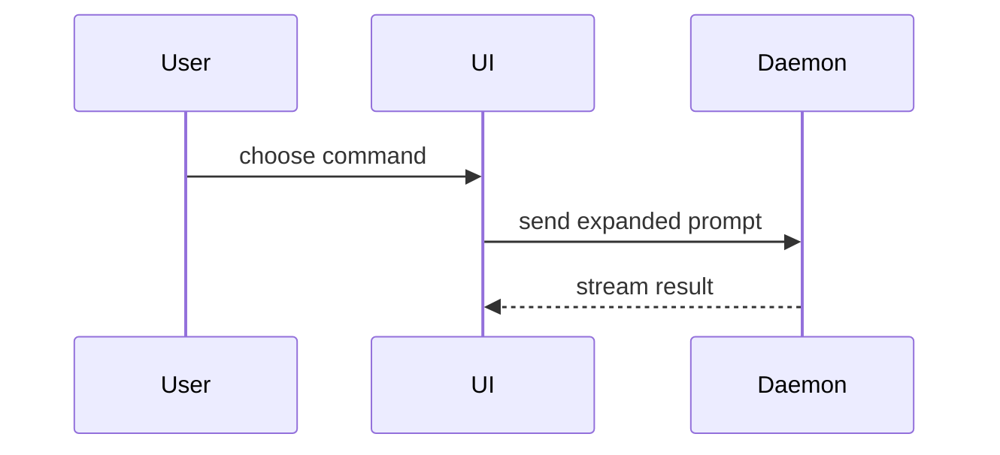

Use this template for the PR body:

```markdown
## Summary

<diagram, diff-sketch, or tree>

## Evidence

- **Before:** <screenshot/output/failing test run>
  **After:** <screenshot/output/passing test run>

## Merge Danger

**Door:** <one-way or two-way>

<optional: description>

**Blast Radius:** <one-word description>

<optional: what the merge can break>
```

## Sections

Skip preambles. Keep the prose short. Use the user's domain language from `GLOSSARY.md`.

After the template, add the closing references that the issue tracker's "How work closes" section asks for.

### Summary

Pick the smallest view that makes the key point clear.

- Show logic or an algorithm as pseudocode:

```text
on(save)
  if content is unchanged
    return cached result
  write new content
  return fresh result
```

- Show runtime control flow as a call tree:

```text
submitForm
  createSession
    persistPrompt
    launchAgent
  navigateToSession
```

- Show UI structure as a component tree, with the state and module boundaries that matter:

```text
<SessionPage> (apps/example/src/routes/session.tsx)
  useSessionEvents()
  <SessionToolbar>
    <RunSkillButton> (packages/ui)
```

- Show file responsibility or a broad refactor as a shallow file tree:

```text
src/
├── commands/       # parses user actions
├── sessions/       # owns session state
└── transport/      # sends API requests
```

- Show component interaction, control flow, or data flow with Mermaid:



- Use `diff` when the point is what changes and the surrounding shape already exists. Match the diff shape to the topic.

For a component change:

```diff
 <SessionPage>
   useSessionEvents()
   <SessionToolbar>
+    <RunSkillButton />
   <SessionTimeline>
+    <SkillResultCard />
```

For a file-layout change:

```diff
 src/
 ├── commands/
+│   └── show-me.ts       # expands the slash command
 ├── sessions/
-└── transport.ts
+└── transport/
+    ├── client.ts
+    └── stream.ts
```

For a call-tree or call-stack change:

```diff
 submitForm
   createSession
     persistPrompt
+    expandSkillMention
     launchAgent
-  navigateToSession
+  navigateToSession
+    subscribeToEvents
```

For a state or control-flow change:

```diff
 on(save)
-  write content
+  if content is unchanged
+    return cached result
+  write new content
+  invalidate cache
```

- Show the whole block when most of it is new, when cut context would hide ownership or order, or when the reader needs a target shape to copy:

```ts
function expandSkill(command: string): string {
  const skillName = command.slice(1);
  return `use the ${skillName} skill`;
}
```

#### Guidance

Put each visual next to the short text it supports. Keep only the calls, files, props, states, and boundaries the reader needs to understand the change.

Use one of these views, or several. You will seldom need all of them.

### Evidence

Give concrete evidence that the change works. Show a before and an after.

Screenshots are the best evidence when the environment supports them and the change is visual.

Execution evidence comes next: test results and console output. Show the exact test that failed before and passes now, as pseudocode.

### Merge Danger

Say whether the change is a one-way or a two-way door. You can walk back through a two-way door, but not through a one-way door. A PR that is cheap to roll back carries less risk. Destructive actions and decisions that are hard to reverse are one-way doors.

The blast radius is the scope of what the PR can affect. Consider every area the PR can break, such as layout shift, breakage for consumers, or mobile layout.
